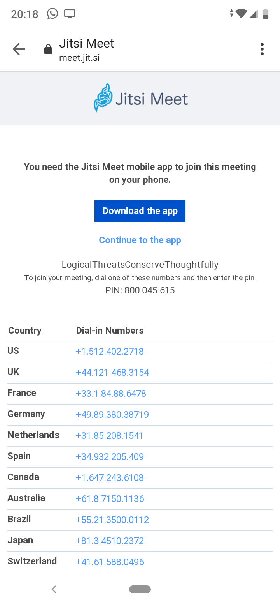

# Guía de usuario

| Basada en la versión inglesa de la guía creada por [Peter E. Humphries](https://community.jitsi.org/u/phumphries/summary): [https://community.jitsi.org/t/end-user-web-conference-guide-for-jitsi/28974](https://community.jitsi.org/t/end-user-web-conference-guide-for-jitsi/28974) |
| ------------- |

## Introducción

Tú puedes crear o asistir a reuniones en Jitsi desde tu navegador o desde la aplicación de Jitsi en un dispositivo móvil.

Para más información sobre Jitsi Meet, puedes ir a [https://jitsi.org/](https://jitsi.org/). Haz clic en "See it in Action! Start a meeting" para crear una nueva reunión.

Jitsi puede gestionar hasta 75 participants en una sala. Para un número mayor de participantes, Jitsi ofrece integración con el servicio de transmisiones en directo de YouTube.

## Acceder una reunión

### Desde ordenador

Jitsi Meet se ejecuta en el navegador así que si te hacen llegar un enlace a una reunión simplemente con seguirlo estarás en ella. Más sencillo imposible!

### Desde dispositivo móvil

Para usar Jitsi desde un dispositivo móvil, debemos instalar una aplicación. Si te llega un enlace de una reunión de Jitsi y lo abres desde el móvil deberás:

| Pasos para dispositivos con sistema operativo Android. Para dispositivos con iOS (iPhone, iPad, ..) pueden variar ligeramente pero son mu similares |
| ------------- |

* Acceder al enlace y seleccionar "Download de app" (descargar la aplicación). En caso de tenerla ya instalada se debe seleccionar "Continue to the app" (continuar en la aplicación) con lo que se accederá directamente a la reunión.

* Se abrirá la página de la instalación, dentro de Google Play en dispositivos Android y App Store si tienes iOS. Seleccionaremos "Instalar".

* Una vez instalada la aplicación y abierta nos pedirá permisos para poder acceder al audio y a la cámara del dispositivo.

* Cuando demos los permisos, ¡ya estaremos dentro de la reunión!

## Crear una reunión

* Ver a https://meet.jit.si/ o haz clic en "See it in Action! Start a meeting" en la página principal de Jitsi, [https://jitsi.org/](https://jitsi.org/). Puedes añadir ?lang=es-es a la URL o utilizar el menú de Ajustes () para cambiar el idioma en que se visualiza Jitsi Meet.

* Escribe un nombre para tu sala, o deja el nombre generado con palabras aleatorias. 

* Haz clic en el botón "IR" ("GO" si te aparece en inglés).

* El navegador puede pedir permiso para acceder a tu cámara y micrófono. Puede ser que necesites activar tu cámara y/o micrófono si están desactivados.

* Tu "sala" está abierta! Haz clic en "Copiar" en el diálogo informativo que aparece para copiar todos los detalles de la reunión, una invitación completa para compartir (por email, un chat, ...). Si solo quieres copiar el enlace a la reunión, usa el icono copiar () al lado del enlace.

